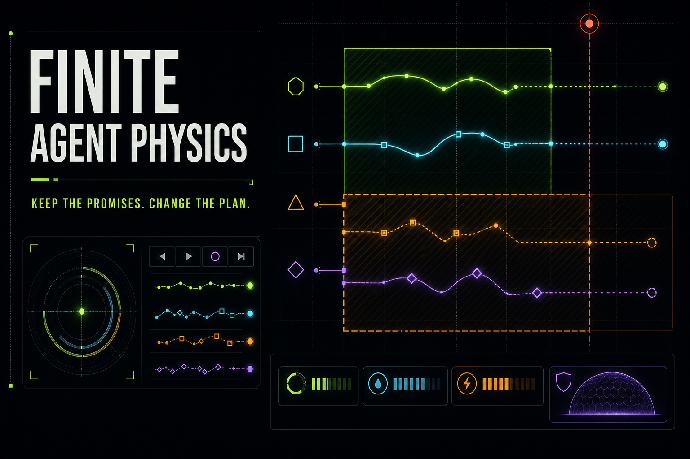
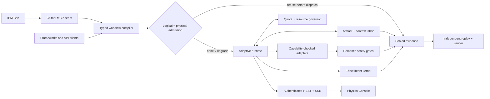

# FINITE / Agent Physics



> Agents can reason. FINITE makes them keep promises.

FINITE is an experimental, framework-neutral SLO runtime for agent workflows. Agent Physics is
the execution science underneath it: a deterministic control layer that decides what may run,
where, and when time, tokens, money, context, provider capacity, physical resources,
reliability, and real-world effects are finite.

This repository is a **v5 release candidate**, not a stable `v5.0.0` release. The stable tag is
fail-closed behind the [v5 release contract](docs/V5_RELEASE_CONTRACT.md): genuine IBM Bob and
live Granite evidence, public release and judge access, human eligibility, SkillsBuild, video,
and submission receipts must exist at one immutable commit. Local tests or polished UI cannot
substitute for those external facts.

The project is being developed for the July 2026 **AI Builders Challenge with IBM Bob**, Wildcard
theme: *Build Intelligent Systems for the Future of Work*.

## Why this exists

Graph libraries express what may happen next. They do not make deadlines, provider queues,
token and cost ceilings, context movement, machine capacity, retries, or consequential actions
disappear. Under pressure, a workflow can finish late, silently weaken required work, overspend,
amplify a provider failure, or repeat an unsafe write.

FINITE compiles promises into typed contracts, preflights them against a finite execution
envelope, refuses impossible work before dispatch, accounts for actual use, changes the residual
plan without erasing settled history, and turns declared writes into durable reviewable intents.

```text
runtime >= max(critical-path latency, total work / available capacity, required transport + RTT)
```

The runtime reports separately named planning and physical lower bounds. Profile values are
declared estimates, not hardware telemetry. Energy remains explicitly unsupported until measured.

## Architecture



The ten cooperating planes are:

1. A strict workflow compiler for canonical Python, JSON, and safe YAML contracts.
2. Logical and physical admission that rejects impossible runs before worker calls.
3. An adaptive residual controller that retains settled work, deadlines, use, and effects while
   remaining locked to the scheduler-admitted backend for each task.
4. Integer quota and resource accounting with independent conservation replay.
5. A content-addressed artifact and bounded-context fabric with lineage obligations.
6. A declared adapter ABI for cancellation, usage, checkpoint, fencing, and effect semantics.
7. Model-independent semantic safety gates with explicit bounded claims.
8. A durable effect-intent kernel with approval, fencing, idempotency, and ambiguity recovery.
9. Append-only evidence, whole-run replay, mutation checks, and release manifests.
10. Bob MCP, authenticated REST/SSE, and a dual static/live Physics Console.

See the detailed [architecture](docs/architecture.md), [effect kernel](docs/effect-kernel.md),
[live-load proof](docs/live-load-proof.md), and [capability audit](docs/capability-status.md).

## Fifty concrete v5 proof points

Everything below is implemented and locally test-backed inside its stated boundary:

1. Strict schema versions and unknown-field rejection.
2. Duplicate-key rejection for JSON and YAML.
3. Canonical cross-format workflow digests.
4. Typed task input/output ports and pre-execution compatibility checks.
5. Dependency, cycle, missing-producer, and graph-shape validation.
6. Required and optional work with protected mandatory ancestry.
7. Conservative deadline, token, cost, context, quality, and reliability admission.
8. Signed-int64 overflow refusal rather than wraparound.
9. CPU-time admission in integer CPU-milliseconds.
10. Conservative peak RAM and VRAM admission.
11. Storage-read and storage-write byte admission.
12. Network ingress, egress, bandwidth, RTT, and egress-cost admission.
13. A separately labeled transport/RTT critical-path lower bound.
14. An explicit physical-resource coverage and limitations matrix.
15. Global and per-provider concurrency enforcement.
16. RPM, TPM, reset-window, bounded-retry, and 429-suppression accounting.
17. Protected multi-resource cost-to-go for mandatory work.
18. Optional-work shedding when headroom disappears.
19. Runtime residual replanning after bounded provider, capacity, budget, and coordinator-recovery events,
    with no fallback to a profile that did not pass logical and physical admission.
20. Durable revision and decision digests for every replan.
21. Absolute deadlines, bounded retries, cooperative cancellation, and visible uncooperative work.
22. Manifest-bound SQLite resume without recalling completed fixture work.
23. Durable content-addressed artifact put/get/dedup with lineage checks.
24. All-or-refuse context packing under byte and token caps.
25. Explicit freshness, contradiction, evidence, and hostile-context handling.
26. Declared adapter capabilities with structured semantic-loss reporting.
27. An optional bounded watsonx.ai/Granite executor adapter with redacted receipts.
28. A structural and semantic-safety pipeline for the fictional StormShift workload.
29. Declared writes diverted from workers into durable proposed effect intents.
30. Exact-scope, time-bound approval grants for high-risk simulated effects.
31. Transactional outbox, idempotency, fencing, crash ambiguity, and compensation drills.
32. Append-only causal run events with public-fact decision explanations.
33. A no-provider-call whole-run verifier that consumes sealed evidence.
34. Mutation rejection across resource, artifact, context, approval, effect, and manifest identities.
35. A real pinned LangGraph conformance witness plus an explicit conversion-loss ledger.
36. Preregistered paired fault and production-survival laboratories with raw records, pass^k,
    p50/p95/p99 recovery timing, local overhead, and duplicate-effect metrics.
37. Twenty-three Bob-callable MCP tools tested through a real STDIO handshake.
38. Typed submit, status, inspect, cancel, approve, and resumable event-stream HTTP routes.
39. A live console that keeps bearer credentials in memory and distinguishes static evidence.
40. Deterministic release-candidate checksums, SBOM, provenance, package inspection, and offline verification.
41. JavaScript-safe workflow integers with browser round-trip and overflow rejection tests.
42. Public liveness and fail-closed readiness probes that exercise both durable stores.
43. Exact-origin CORS, constant-time bearer checks, bounded request bodies, and strict JSON parsing.
44. Start-paused execution with revision-fenced budget, provider, capacity, reset, and resume controls.
45. Call-free controller replay that binds every transition to prior/next state and control digests.
46. Coordinator-crash recovery that charges ambiguous in-flight work without recalling it.
47. Explicit admission caps and monotonic SSE cursors, exercised by a digest-bound 64-run real-socket load proof.
48. Run-scoped effect idempotency proven across sequential, concurrent, and restarted executions.
49. A non-root, read-only, capability-dropped OCI runtime with bounded CPU, memory, PIDs, and writable state.
50. Zero-skip JUnit evidence, separate statement/branch gates, pinned dependency audits, and source/image scans.

These are not claims of universal superiority, production readiness, live Granite success, or
deployment by Miami-Dade County. The exact limits are maintained in [limitations](docs/limitations.md).

## Quick start

Python 3.11 or later is required.

```powershell
python -m pip install -e ".[dev,api,langgraph]"
python -m pytest
agent-physics demo --policy adaptive
finite-api
```

In a second terminal, inspect the local service or connect the Physics Console:

```powershell
cd apps/physics-console
npm ci
npm test
npm run dev
```

The console accepts an exact API origin and an optional bearer token in memory. The committed
artifact is a sealed deterministic replay. Its live path starts the bundled `stormshift` workflow
paused, can inject a budget cut or simulated provider 429/reset through revision-fenced controls,
shows the call-free replay digest, resumes from that revision, streams the durable ledger over
SSE, and verifies run/effect isolation through the final inspection endpoint.

For an authenticated browser demo, start the API with an exact console origin:

```powershell
$env:FINITE_CONTROL_BEARER_TOKEN = "replace-with-at-least-32-random-characters"
$env:FINITE_CONTROL_ALLOWED_ORIGINS = "http://localhost:3000"
finite-api --host 127.0.0.1 --port 8080
```

The hardened container path requires the same bearer token and binds to loopback by default:

```powershell
$env:FINITE_CONTROL_BEARER_TOKEN = "replace-with-at-least-32-random-characters"
docker compose up --build
```

Useful local evidence commands:

```powershell
agent-physics demo --policy sequential
agent-physics judge-bundle
agent-physics fair-benchmark --output artifacts/fair-benchmark
agent-physics production-survival --trials 10 --output artifacts/production-survival
agent-physics production-survival --verify-only artifacts/production-survival
python scripts/run_live_load.py --output artifacts/live-load
python scripts/run_live_load.py --verify-only artifacts/live-load
python scripts/export_console_artifact.py
python scripts/generate_release_candidate.py --help
python scripts/verify_release_candidate.py --help
```

The optional external comparator and IBM adapter are isolated extras:

```powershell
python -m pip install -e ".[langgraph]"
agent-physics langgraph-baseline --output artifacts/langgraph-baseline.json

python -m pip install -e ".[watsonx]"
python -c "from agent_physics.bob_lifecycle import default_bob_run_service; print(default_bob_run_service().granite_preflight())"
```

## Bob is a requirement, not a logo

FINITE exposes 23 local STDIO MCP tools for capability discovery; preflight, run, status,
explanation, and verification; deterministic simulation; quota, context, effect, replanning,
physical-admission, framework-conformance, adaptive-recovery, production-survival, and
artifact-integrity drills; and bounded Granite readiness. See the [Bob MCP guide](docs/bob-mcp.md),
[production-survival protocol](docs/production-survival.md), and
[session runbook](docs/bob-session-runbook.md).

The committed [Bob build log](docs/bob-build-log.md) must contain only real entrant-owned Bob
sessions. It is intentionally not backfilled from Codex work. On 2026-07-24, genuine IBM Bob Shell
sessions invoked all 23 MCP tools against executable commit `2be8f80`, including the durable
lifecycle and 60/60 production-survival proof. The redacted provenance summary and hashes are in
[the Bob validation record](docs/bob-live-validation-2026-07-24.md). Stable v5 remains blocked on
the remaining release contract, including a genuine same-run live-watsonx receipt.

## Granite / watsonx.ai boundary

The optional adapter calls IBM `ModelInference` with SDK retries disabled so FINITE owns attempt
accounting. It records a redacted receipt with model ID, measured latency, provider-reported usage
when present, and request/output digests. Tests use an injected fake inference client and do not
count as IBM evidence. See the [watsonx adapter guide](docs/watsonx-adapter.md).

## Comparison with PageAgent and LangChain

FINITE does not compete with PageAgent on DOM-native browser action or with LangChain on its
integration ecosystem. It targets a different layer: admission, resource physics, adaptive
control, effect authority, and independently verifiable evidence around authored workflows.

The dated [competitive landscape](docs/competitive-landscape.md) compares 16 leading public
repositories using primary GitHub sources, including Alibaba PageAgent, LangChain, LangGraph,
AutoGen, CrewAI, Dify, Langflow, n8n, Agno, and others. It records what each project proves,
where FINITE is differentiated, and 45 gaps that must not be hidden behind star counts.

## Current evidence and release state

Local evidence already includes the Python suite, core coverage above the v5 threshold, a real MCP
protocol handshake, a live local HTTP/SSE end-to-end run, console build/lint/render tests, a
preregistered production-survival runner, and a zero-vulnerability `npm audit` at verification
time. The public repository is
[marcpoliquin5/finite-agent-physics](https://github.com/marcpoliquin5/finite-agent-physics);
the exact final counts and hashes belong in generated evidence rather than hand-maintained
marketing prose.

The Physics Console is deployed at
[finite-agent-physics.marcpoliquin5.chatgpt.site](https://finite-agent-physics.marcpoliquin5.chatgpt.site),
currently with owner-only access. It is not yet an anonymous judge URL.

Stable `v5.0.0` is still blocked by:

- genuine, timestamped IBM Bob build and MCP lifecycle evidence;
- a real live-Granite/watsonx run and redacted provider receipt;
- an immutable reviewed release tag with candidate assets and signed-out hash verification;
- anonymous or explicitly judge-shared deployment access and signed-out verification;
- entrant eligibility, event registration, and IBM SkillsBuild evidence;
- a captioned public video of no more than three minutes; and
- final project-page publication and submission receipts.

Track the exact handoff in the [submission checklist](docs/submission-checklist.md),
[submission draft](docs/submission-draft.md), and [three-minute demo script](docs/demo-script.md).

## Safety boundary

StormShift is fictional. No code in the demo publishes an emergency alert or contacts Miami-Dade,
an emergency service, or any public audience. High-risk writes stop at a proposed intent unless a
separately configured simulation target receives an exact approval. Do not connect the release
candidate to a real consequential system without a new threat model, production IAM, isolation,
retention policy, operational review, and target-side idempotency evidence.

## License

Apache-2.0. See [LICENSE](LICENSE).
