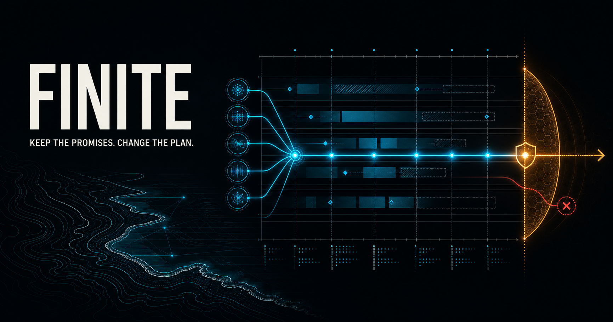
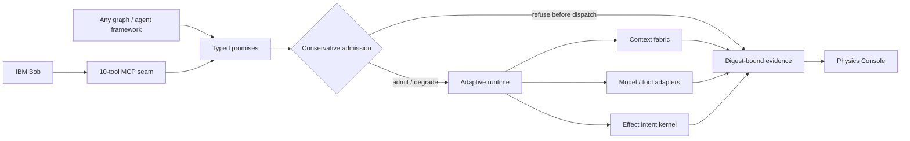

# Agent Physics / FINITE



**FINITE is the SLO runtime for AI agents. Agent Physics is the execution science behind it.**

Agent frameworks are good at expressing *what may happen next*. FINITE is an
experimental, framework-neutral runtime for deciding *what should run where and when*
when time, tokens, money, context, provider capacity, reliability, and real-world side
effects are finite.

> It does not beat physical limits. It makes them first-class scheduling constraints.

This repository is being developed for the July 2026 **AI Builders Challenge with IBM
Bob**, Wildcard theme: *Build Intelligent Systems for the Future of Work*.

## Problem statement

Agent frameworks can express dependencies and hand work to models or tools, but a graph does
not make deadline, provider capacity, token, cost, context, reliability, retry, and real-world
effect limits disappear. Under pressure, a workflow can finish late, silently weaken required
work, overspend, amplify a provider failure, or repeat an unsafe action.

## Solution

FINITE adds a framework-neutral control plane around agent work. It compiles required promises
into typed contracts, preflights them against a finite execution envelope, selects an admissible
plan, refuses impossible runs before dispatch, accounts for actual use, persists restart state,
and turns declared writes into reviewable effect intents. The deterministic evidence surface is
called **Agent Physics** because it measures what a plan can and cannot promise under explicit
constraints.

## The category-defining idea

> Agents can reason. FINITE makes them keep promises.

Every real execution has a theoretical lower bound:

```text
runtime >= max(critical-path latency, total work / available capacity, required network RTT)
```

The current simulator reports a separate **planning-model bound** computed from selected
p95 profile estimates. That is a consistency check for the deterministic model, not a claim
about physical runtime. Most orchestration diagrams also omit provider queues, token and
cost budgets, context movement, tail latency, retries, write conflicts, and the fact that
some actions cannot safely be repeated. Agent Physics puts those constraints into an
**execution envelope**, then continuously accounts for them.

The architecture has seven cooperating planes:

1. **Intent compiler** - turns goals into typed task and effect contracts.
2. **Constraint solver** - admits, rejects, or degrades plans before they overspend.
3. **Adaptive scheduler** - chooses topology, backend, parallelism, and speculation online.
4. **Context fabric** - moves content-addressed artifacts instead of rebroadcasting transcripts.
5. **Effect kernel** - protects irreversible actions with capabilities, idempotency, and approval.
6. **Evidence ledger** - records causal events, resource use, policy decisions, and provenance.
7. **Control plane** - makes the critical path, resource pressure, and adaptation visible.



## Executable vertical slice

The initial slice is intentionally deterministic. It lets us validate scheduler mechanics
before cloud-model variance can hide mistakes.

```powershell
python -m pip install -e ".[dev]"
agent-physics demo --policy adaptive
agent-physics demo --policy sequential
python scripts/export_console_artifact.py
agent-physics judge-bundle
python -m pytest
```

The local Physics Console has its own locked toolchain:

```powershell
cd apps/physics-console
npm ci
npm test
npm run dev
```

It currently demonstrates:

- typed task, backend, resource, and side-effect contracts;
- a strict versioned workflow IR whose Python, JSON, and safe-YAML forms compile to the same
  canonical digest and reject unknown or duplicate fields;
- dependency and cycle validation;
- critical-path priority calculation;
- deadline-, quality-, reliability-, token-, cost-, and context-aware backend selection;
- global and per-provider concurrency limits;
- serialization of conflicting writes;
- schema-level approval-gate and idempotency requirements for irreversible effects;
- optional-work shedding under constrained envelopes;
- protected multi-resource cost-to-go for mandatory work;
- deterministic simulation events, cancellation settlement, and fail-closed trace verification;
- an independently replayed 10,000-transition integer resource-ledger stress corpus covering
  reservations, settlements, refunds, cap refusal, overrun refusal, and identity conflict;
- immutable evidence artifacts, freshness/conflict assessment, and all-or-refuse context obligations;
- a SQLite effect-intent/outbox state machine with scoped approval grants, fencing, idempotency,
  crash ambiguity, and compensation against a simulation-only target;
- a fixture-only async executor with conservative admission, bounded retries and concurrency,
  absolute deadlines, cancellation, reported-use enforcement, manifest-bound resume, and an
  explicit `awaiting_effects` terminal boundary;
- a migration-tested append-only SQLite run ledger with completion-provenance invariants;
- a typed fictional StormShift workload with digest-bound structural validation and explicit
  limitations;
- a complete 450-record deterministic experiment design with one nominal control, four fault
  transformations, 30 paired seeds, per-seed deltas, Wilson intervals, and paired bootstrap
  intervals;
- a Bob-compatible STDIO MCP server verified through a real protocol handshake;
- an optional watsonx.ai adapter that records live-labeled, redacted inference receipts;
- sequential and static-parallel development-reference policies;
- a digest-bound Physics Console whose 1,080 pressure states are generated by the Python kernel,
  not reimplemented in browser logic;
- one canonical judge bundle that seals feasible/refused preflights, conservation reports,
  StormShift adversarial checks, durable restart evidence, all 450 experiment records, console
  verification, revision provenance, and explicit limitations under one content digest.

No performance claim is considered valid until it is reproduced by the benchmark suite.
See [the claim boundary](docs/claims-and-prior-art.md), [known limitations](docs/limitations.md),
[the 60-capability engineering program](PROGRAM.md), and its
[acceptance audit](docs/capability-status.md).

## Designed with Bob, callable by Bob

IBM Bob’s July 2026 release already includes a shared agent harness, parallel execution,
subagents, workflow orchestration, model routing, approvals, and usage analytics. FINITE does
not imitate those capabilities. It is being built as a constraint-verification and runtime
control extension that Bob can call through ten MCP tools: preflight a workflow, inspect a
schedule, verify invariants, execute and resume trusted fixtures, validate StormShift structure,
and run the registered deterministic experiment. See
[the IBM/Bob product boundary](docs/ibm-bob-fit.md).

## Demonstration: Miami EOC pressure test

The first scenario simulates an emergency-operations team assembling shelter, transit,
flood, hospital, utility, and multilingual alert information under a hard deadline. The
final public alert is declared as an irreversible effect, so the graph must declare an
approval gate and idempotency key. The simulator never performs that effect. Every backend
in the current scenario is explicitly labeled simulated or fixture-backed; live IBM Granite
inference will be a separate presentation and evaluation path.

## IBM Bob requirement

IBM Bob must be a core development tool for the challenge entry. This repository therefore
keeps an explicit, auditable [Bob workstream](docs/bob-workstream.md) and
[build log](docs/bob-build-log.md). Entries must describe real Bob sessions; they must never
be backfilled or fabricated. IBM Granite/watsonx is planned as a runtime backend, but that
does not replace the requirement to use Bob substantially during development.

**Current gate:** the Bob build log is intentionally empty until the entrant performs real Bob
planning, coding, testing, and MCP sessions. The repository does not present Codex work as Bob
work. This requirement is incomplete until genuine evidence is added.

## Status

Alpha vertical slice. The simulator, feasibility certificates, conservation verifier,
artifact/context subsystem, effect kernel, durable fixture executor, StormShift validator,
registered deterministic experiment, Bob MCP seam, and local/private Physics Console are
implemented and tested. Live Granite evidence, genuine Bob provenance, a tuned external
framework baseline, public GitHub publication, SkillsBuild completion, and the three-minute
submission video remain release blockers. Track them in the
[submission checklist](docs/submission-checklist.md) and [roadmap](ROADMAP.md).
