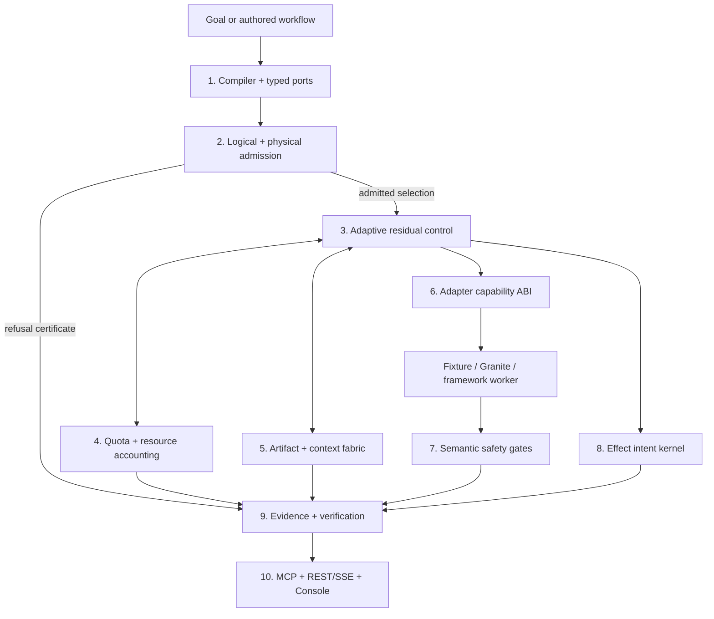
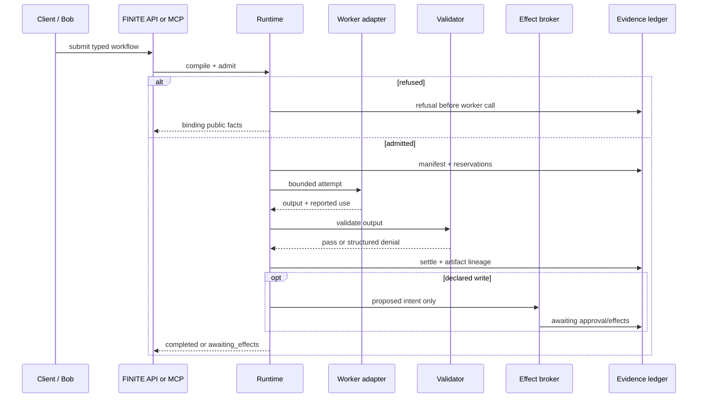

# FINITE v5 architecture

## North-star invariant

FINITE maximizes useful, verified work subject to an explicit finite execution envelope. It must
never create capacity by hiding usage, improve latency by silently weakening required quality,
recover by erasing settled work, or complete by duplicating an irreversible action.

The candidate is intentionally split into probabilistic **workers** and deterministic
**authority**. A model may propose a graph, result, or action. Only typed validation, admission,
resource settlement, semantic gates, approval, and durable state may authorize progress.

## Mathematical boundary

For a directed acyclic graph `G = (V, E)`, selected work `W`, critical-path span `S`, effective
capacity `K`, declared transport bytes `B`, bandwidth `b`, and required RTTs `R`:

```text
T_physical_lower >= max(S, W / K, critical_path((8B / b) + R))
```

FINITE keeps two different numbers:

- the **planning-model bound**, derived from selected p95 profile estimates; and
- the **transport/RTT physical lower bound**, derived from declared integer byte, bandwidth, and
  RTT fields.

Neither number is measured wall-clock performance. CPU, RAM, VRAM, storage, and network values
are declared profile estimates. Energy is explicitly unsupported until hardware telemetry exists.

The admitted execution also satisfies declared caps for tokens, micro-USD, context bytes, CPU
time, peak RAM/VRAM, storage IO, network transfer, bandwidth, RTT, egress cost, global/provider
concurrency, quality, reliability, deadlines, and effect policy. Integer dimensions fail closed on
signed-int64 overflow.

## Ten planes



### 1. Compiler and typed ports

Workflow IR v2 accepts strict Python mappings, duplicate-rejecting JSON, and safe
duplicate-rejecting YAML. It normalizes one canonical document and SHA-256 digest. Explicit wire
integers must fit JavaScript's exactly representable range; internal signed-int64 "unbounded"
physical sentinels are omitted from the wire and restored only after parsing. Unknown fields,
unsupported schema versions, cycles, unknown dependencies, duplicate IDs, missing producers, and
incompatible typed input/output ports are rejected before execution.

An LLM may suggest a candidate graph, but it cannot grant capabilities, enlarge a budget, lower a
required quality floor, or authorize a write.

### 2. Logical and physical admission

The logical scheduler selects a valid backend profile while protecting mandatory work across
deadline, token, cost, context, quality, reliability, and concurrency constraints. The physical
analyzer then checks CPU, memory, VRAM, storage, network, bandwidth, RTT, and egress against the
same selection. Adapter requirements and deterministic serial p95 deadline feasibility are checked
at this boundary as well. Both planes run before the runtime calls a worker, and the live controller
binds every task to that exact admitted profile. A provider block may wait, shed already-admitted
optional work, or refuse the residual run; it cannot fall through to an unadmitted backend.

The analyzer returns a digest-bound coverage matrix that distinguishes estimated, derived, and
unsupported dimensions. A refusal is a conservative admission refusal, not a general proof that
no conceivable implementation could succeed.

### 3. Adaptive residual control

The runtime can apply typed capacity, failure, settlement, and envelope events to the durable
residual state. The API can start a run paused and accept revision-fenced provider 429/reset,
capacity, budget-cut, resume, and coordinator-recovery facts. Every revision retains elapsed time,
settled use, completed outputs, deadlines, effect boundaries, and prior digests. Optional work may
be shed; completed work is never recalled merely because the plan changes. A separate replay path
reconstructs the controller without calling a worker or provider.

Task and run deadlines are absolute. Residual serial feasibility is rechecked before dispatch, and
a worker settlement received after its declared deadline is charged conservatively before the run
refuses. Terminal controller sessions are retired from process memory while durable replay remains
available. The control-event limit reserves capacity atomically before concurrent requests yield.

The local controller is a single-coordinator implementation. It does not provide distributed
leader election, cross-host leases, or high availability.

### 4. Quota and resource accounting

Integer ledgers reserve, settle, refund, and refuse use. Independent replay verifies conservation,
identity, non-negativity, and caps. A separate provider model represents RPM, TPM, concurrency,
reset windows, retries, and 429 suppression. Its events are declared/modelled data unless a real
provider receipt says otherwise.

### 5. Artifact and context fabric

Immutable artifact identities bind payload bytes, media type, sensitivity, producer, parents, and
transform lineage. A durable local store provides put/get/dedup and referential-integrity checks.
The context packer records included and excluded items and refuses when required evidence cannot
fit or satisfy freshness/trust obligations.

SQLite metadata plus local blobs are a development boundary, not a replicated object store.

### 6. Adapter capability ABI

Adapters declare cancellation, checkpoint/resume, streaming, usage settlement, supported effect
classes, fencing, and hidden-retry semantics. Compilation produces an explicit compatibility or
semantic-loss result; unsupported required semantics block execution.

The watsonx worker uses one SDK request per FINITE attempt with SDK retries disabled. Because the
SDK call is synchronous and runs in a thread, Python cannot safely hard-kill it. FINITE can reject
late settlement, but production hard cancellation requires process isolation.

### 7. Semantic safety gates

StormShift uses bounded model-independent validators for public fields, evidence references,
freshness, numeric consistency, bilingual equivalence within declared rules, accessibility
attestations, hostile instructions, and effect readiness. The verifier does not claim general
natural-language entailment or human-quality translation evaluation.

Unsafe, stale, unsupported, mistranslated, or inaccessible required outputs cannot become a
committable publication intent in the tested path.

### 8. Effect intent kernel

Declared writes never enter fixture or Granite workers. The runtime creates a durable proposed
intent. High-risk simulated actions require an exact-scope, time-bound approval grant. The broker
key deterministically binds run, task, attempt, and the declared logical key; the logical key stays
in the receipt for audit. This keeps restart retries idempotent inside a run while preventing two
sequential or concurrent runs from sharing an intent. Fencing, a transactional outbox, ambiguity
recovery, and compensation are tested against a simulation-only target.

Run and effect ledgers remain separate SQLite transaction domains. Stable idempotency repairs the
demonstrated crash gap, but there is no cross-database atomic commit.

### 9. Evidence, replay, and release manifest

Append-only events record graph and manifest identities, attempts, public-fact decisions,
reservations, settlements, outputs, approvals, and effects. The whole-run verifier consumes sealed
evidence without planner objects, databases, or model/tool calls. Mutation tests fail closed across
resource, artifact, context, approval, effect, causal, and manifest identities.

Release-candidate tooling additionally inspects wheel/sdist contents, validates package metadata
and RECORD hashes, rejects unsafe archive paths and secret-like files, and emits deterministic
checksums, CycloneDX SBOM data, and SLSA-style provenance. These artifacts explicitly declare
`release_ready=false` until every external gate passes.

### 10. Control surfaces

- **MCP:** 22 local tools, including the Bob lifecycle and v5 evidence drills, over STDIO.
- **REST:** versioned submit, status, inspect, cancel, effect approval, adaptive control/replay,
  reference-workflow, health/readiness, and ordered-event endpoints.
- **SSE:** resumable per-run event streaming with cursor validation and heartbeats.
- **Console:** a sealed static replay plus an optional live API mode; bearer tokens stay in memory.

The control API uses a configured bearer token, exact-origin CORS, strict bounded JSON, a
process-local active-run limit, and a durable per-run control-event limit. The OCI deployment runs
as a non-root user with a read-only root filesystem, dropped capabilities, no-new-privileges,
bounded CPU/memory/PIDs, and one explicit writable state volume. TLS, distributed rate limiting,
OIDC, tenant RBAC, retention automation, and distributed ownership remain deployment
responsibilities.

## Durable execution sequence



## StormShift reference workload

StormShift is a fictional emergency-operations coordination graph. Ten pure/read tasks produce a
response plan and bilingual preview; an eleventh publication task is a declared irreversible
effect. Fixture execution validates the report and stops at `awaiting_effects`. No code in the
demo contacts Miami-Dade, emergency services, or a public audience.

## Deployment topology

The current executable topology is one Python process, one SQLite run store, an optional separate
SQLite effect store, local artifact storage, and a Next.js console. A deployed console build exists,
but its current Sites access policy is owner-only. No public API service or anonymous judge path is
claimed.

## Stable-v5 boundary

Local implementation is only one part of the release. The stable tag additionally requires real
Bob provenance, a live Granite receipt, a public immutable GitHub release, anonymous or explicitly
judge-shared deployment verification, eligibility and SkillsBuild evidence, an accessible public
video, and submission receipts. The complete conjunctive gates are in
[`V5_RELEASE_CONTRACT.md`](V5_RELEASE_CONTRACT.md).
