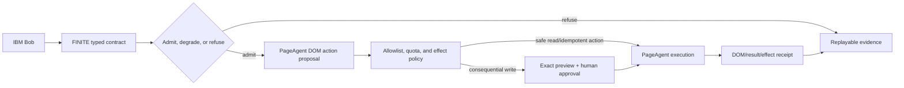

# Competitive landscape and release-gap audit

**Snapshot:** July 20, 2026 ET. GitHub counters were collected from the public repository pages
and REST metadata during this audit; they will drift. Stars and forks are adoption signals, not
correctness, safety, benchmark, or architecture evidence.

## Bottom line

FINITE is not yet a category leader as a shipped open-source product. It has an unusually deep
deterministic constraint/evidence kernel for an alpha project, but the leading repositories win
today on distribution, integration breadth, release cadence, public proof, and community trust.

The defensible category position is:

> **LangChain supplies components. LangGraph supplies stateful workflow control. PageAgent and
> browser-use supply action surfaces. FINITE supplies admission, finite-resource control,
> effect boundaries, and replayable evidence around them.**

That is a stronger position than claiming to replace every framework. A framework-neutral FINITE
adapter can govern a LangGraph workflow, a PageAgent browser action, an IBM Bob tool call, or a
plain Python worker under the same execution envelope.

## Relevant high-adoption cohort

This is a cohort of repositories relevant to agent orchestration, agent platforms, browser agents,
and component ecosystems. It is not a claim that these are the most-starred repositories on all
of GitHub, and products in different rows are not interchangeable.

| Repository | Category | Stars | Forks | Latest release at snapshot | What adoption is buying |
|---|---|---:|---:|---|---|
| [n8n](https://github.com/n8n-io/n8n) | Workflow/agent platform | 197,239 | 59,494 | `stable`, Jul 20 | Visual authoring, self-host/cloud, approvals, observability, 1,500+ integrations, templates |
| [Dify](https://github.com/langgenius/dify) | LLM application platform | 149,523 | 23,567 | `1.16.0`, Jul 17 | Visual workflows, RAG, agents, model management, tools, observability, deployment |
| [LangChain](https://github.com/langchain-ai/langchain) | Component/integration framework | 142,191 | 23,648 | `1.3.14`, Jul 16 | Model interoperability, components, integrations, ecosystem, quick prototyping |
| [browser-use](https://github.com/browser-use/browser-use) | Browser agent | 105,763 | 11,643 | `0.13.6`, Jul 17 | End-to-end browser action, Python package/CLI, examples, cloud path, integrations |
| [AutoGen](https://github.com/microsoft/autogen) | Multi-agent framework | 59,852 | 9,009 | `0.7.5`, Sep 2025 | Message-passing agents, Studio, benchmarks; now explicitly in maintenance mode |
| [CrewAI](https://github.com/crewAIInc/crewAI) | Multi-agent framework | 55,861 | 7,895 | `1.15.5`, Jul 20 | Role/crew/flow ergonomics, integrations, docs, rapid releases |
| [LlamaIndex](https://github.com/run-llama/llama_index) | Data/agent integration layer | 50,963 | 7,784 | `0.14.23`, Jun 24 | Retrieval/data abstractions, document agents, 300+ integration packages |
| [Agno](https://github.com/agno-agi/agno) | Agent platform/runtime | 41,316 | 5,665 | `2.8.0`, Jul 20 | SDK, service runtime, UI, RBAC, traces, simulations, 100+ integrations |
| [LangGraph](https://github.com/langchain-ai/langgraph) | Stateful orchestration library | 37,703 | 6,322 | `1.2.9`, Jul 10 | Durable execution, interrupts, memory, graph control, LangSmith ecosystem |
| [PageAgent](https://github.com/alibaba/page-agent) | In-page browser/GUI agent | 27,302 | 2,397 | `1.12.2`, Jul 16 | One-script integration, DOM action, live demo/docs, extension, npm, beta MCP |
| [PydanticAI](https://github.com/pydantic/pydantic-ai) | Typed agent framework | 18,677 | 2,395 | `2.14.0`, Jul 20/21 UTC | Type safety, structured output, dependency injection, evals, observability |
| [CAMEL](https://github.com/camel-ai/camel) | Multi-agent research framework | 17,446 | 2,014 | `0.2.91a5`, Jul 13 | Research breadth, simulations, benchmarks, multi-agent scale, community |
| [Microsoft Agent Framework](https://github.com/microsoft/agent-framework) | Production multi-agent framework | 12,255 | 2,062 | `python-1.11.0`, Jul 10 | Python/.NET, checkpoints, streaming, HITL, OpenTelemetry, DevUI, hosting |

AutoGen's star count remains informative historically, but its README directs new projects to
Microsoft Agent Framework. A current comparison should therefore track both rather than treating
AutoGen as Microsoft's active destination.

## What the leading repositories contain

The recurring pattern is not “more features” alone. The leaders reduce the time between discovery
and a successful first run, then give users confidence that the project will still work next month.

| Product signal | PageAgent | LangChain/LangGraph | Dify/n8n | FINITE now |
|---|---|---|---|---|
| Install path | One script or `npm install` | `uv add` / `pip install` | Docker, npm, or hosted | Editable Python install; console is a second install |
| Public demo/docs | Live demo and docs site | Extensive docs, academy, forum | Hosted/self-host paths and visual UI | Private console; repository docs only |
| Published releases | 37 GitHub releases; npm package | PyPI packages and frequent releases | Frequent platform releases | No public repository, package release, or tag yet |
| Examples/templates | Product use cases and playground | Guides, examples, ecosystem templates | Thousands of workflows/integrations | One deep fictional StormShift workload |
| CI/tests | Build, lint, typecheck, workspace tests | Large test suites and CI | Large monorepo/e2e suites | Strong local deterministic tests and CI definition, not publicly running |
| Security/governance | Security policy, contribution guide, code of conduct, issue templates | Established community/governance surface | Security and contribution programs | Security/contribution docs; governance templates added by this audit |
| Deployment | Browser/CDN/npm | LangSmith deployment path | Cloud and self-host | No authenticated service or anonymous public deployment |
| Integrations | Browser DOM, extension, MCP, model clients | Broad model/tool/vector/data ecosystem | Hundreds to 1,500+ connectors | IBM/watsonx adapter, Bob MCP seam, fixture workers; few production adapters |
| Evidence | Product tests and operational UX | Tracing/evals through ecosystem | Observability and audit features | Deterministic digests, replay, ledgers, claim boundaries; live evidence missing |

Repository anatomy matters. PageAgent has a TypeScript workspace split into core, LLM, page
controller, UI, browser extension, MCP, and website packages; it also has CI, unit/live tests,
release automation, a changelog, security policy, contribution guide, code of conduct, issue
templates, docs, and a public demo. LangGraph has library packages, docs, examples, integrations,
tests, CI, checkpoints, and a published package. The high-star platforms add deployable services,
authentication, observability, integrations, templates, and support channels.

## PageAgent versus FINITE

PageAgent and FINITE are adjacent, not equivalent. PageAgent executes natural-language actions in
a browser. FINITE decides whether declared work is admissible and how it may proceed under finite
resources and effects. Comparing them as substitutes would obscure the best integration.

| Dimension | Alibaba PageAgent | FINITE now | Competitive consequence |
|---|---|---|---|
| Primary job | GUI agent living inside a webpage | Constraint/evidence control plane for task graphs | Complementary layers |
| First run | One CDN script or npm install | Python editable install plus commands | PageAgent wins discovery-to-value |
| Action substrate | Text DOM actions in current page | Fixture/model/tool adapter interface; no browser executor | FINITE needs a visible real action surface |
| Visual input | Explicitly no screenshots or multimodal vision | No browser perception layer | Neither covers visual-only UI today |
| Page scope | Current-page SPA; extension adds multi-tab | Framework-neutral task graph | Different topology |
| Models | OpenAI-compatible/BYO and local-model support | Optional watsonx adapter; fixture profiles dominate current evidence | PageAgent is easier to try live |
| MCP | Beta server with execute/status/stop | Thirteen typed evidence/control tools | Tool count is not a quality metric; purposes differ |
| Interaction policy | Documented element allow/block lists and confirmation controls | Typed effect classes, grants, idempotency, fencing, outbox | FINITE's boundary is deeper, but only simulation-proven |
| Admission before spend | Not presented as a first-class repository feature | Conservative feasible witness or refusal before dispatch | Strong FINITE wedge |
| Multi-resource accounting | Not presented as a first-class repository feature | Deadline, tokens, cost, context, concurrency, provider limits | Strong FINITE wedge |
| Provider quota physics | Not presented as a first-class repository feature | RPM/TPM/concurrency/reset/retry/deadline model with replay | Strong FINITE wedge, currently local/modelled |
| Dynamic recovery | Agent loop and stop control | Residual-graph replanning retains settled state/effect boundaries | Strong FINITE wedge, currently fixture/modelled |
| Durable restart | Not a headline in audited PageAgent repository | SQLite run/effect state and resume invariants | FINITE advantage in current local scope |
| Evidence | CI/tests and product telemetry surface | Digest-bound decisions, artifacts, ledgers, replay, judge bundle | FINITE's most distinctive proof surface |
| Browser usefulness | Direct and obvious | None without an adapter | Major FINITE gap |
| Distribution | Public demo, npm, CDN, Chrome extension, releases | Private console and unpublished Python project | Largest product gap |
| Community trust | 27.3k stars, 2.4k forks, discussions, releases | No public repo or users yet | Largest adoption gap |
| Declared limitations | DOM-only; no hover/drag/right-click/visual canvas; iframe/editor limits | Local coordinator, simulated effects, incomplete semantic/live/distributed proof | Both document boundaries; FINITE must keep doing so |

### The high-value integration

The jaw-drop demo is not a cloned PageAgent. It is a governed PageAgent:



An honest adapter acceptance gate would require:

1. A PageAgent action is represented as a typed tool/effect contract, not an opaque prompt.
2. The request binds origin, page identity, task text, permitted elements/actions, and timeout.
3. Secrets and protected fields are masked before model context is constructed.
4. Reads, reversible writes, and irreversible writes receive different policy treatment.
5. Consequential writes emit a preview and cannot execute without a scoped approval grant.
6. Retry is forbidden or idempotency-bound when the browser action can mutate state.
7. Provider calls consume admitted quota and settle actual use from a receipt where available.
8. DOM/action/result evidence is content-digested with explicit redaction and retention rules.
9. Cancellation and ambiguous completion are represented explicitly; neither is called success.
10. A capacity loss triggers residual replanning without replaying a completed browser action.
11. Hostile page text cannot broaden tools, permissions, approval, or policy.
12. A deterministic sealed replay is available when a live browser/model demonstration fails.

## LangChain and LangGraph versus FINITE

LangChain's own README routes advanced orchestration to LangGraph. The fair comparison is therefore
LangChain for components/integrations, LangGraph for stateful graph execution, and FINITE for the
constraint/evidence layer.

| Dimension | LangChain | LangGraph | FINITE now |
|---|---|---|---|
| Main abstraction | Interoperable models, tools, retrieval, components | Low-level long-running stateful graph | Typed tasks/resources/effects plus execution envelope |
| Adoption | About 142k stars | About 37.7k stars | Not public |
| Integrations | Core strength | Uses LangChain ecosystem but can stand alone | Few production adapters |
| Graph control | Routes advanced orchestration to LangGraph | Nodes, edges, branching, subgraphs | Validated DAG and constrained scheduling |
| Durable execution | Ecosystem-dependent | First-class checkpoint/resume claim | SQLite fixture executor/run state with bounded claims |
| Human in loop | Ecosystem-dependent | First-class interrupts/state inspection | Scoped effect approval flow |
| Memory | Broad components | Short- and long-term memory | Content-addressed evidence/artifact obligations |
| Streaming/deployment | Ecosystem and LangSmith | Ecosystem/production deployment path | No public service/SSE path yet |
| Pre-dispatch feasibility | Not a headline claim in audited README | Not a headline claim in audited README | First-class admission certificate/refusal |
| Resource reservation | Not a headline claim in audited README | Not a headline claim in audited README | Integer reservations, settlements, refunds, refusal |
| Deadline/token/cost/context co-admission | Typically application policy | Typically application policy | Core execution-envelope semantics |
| RPM/TPM/reset-aware retry control | Provider/application layer | Provider/application layer | Explicit local quota state machine and replay |
| Optional-work shedding | User-authored routing | User-authored routing | Scheduler policy protects mandatory cost-to-go |
| Residual replanning | Can be authored | Can be authored as graph/application logic | Typed event-driven controller with retained settled state |
| External-effect protocol | Tools/middleware/application | Interrupts/application logic | Intent, grant, fencing, idempotency, outbox, ambiguity model |
| Decision evidence | LangSmith tracing/evals ecosystem | LangSmith tracing/state views | Local public-fact explanations and digest-bound verifier |
| Current production breadth | High | High relative to library scope | Alpha research slice |

FINITE now includes a real, pinned LangGraph `1.2.9` comparator using `StateGraph` and the SQLite
checkpointer on the identical StormShift fixture. It verifies task joins, outputs, structural
validation, a fixed profile manifest, checkpoint equality, concurrency caps, and proposal-only
effect behavior. It deliberately makes no latency, reliability, or cost superiority claim. Run:

```powershell
python -m pip install -e ".[langgraph]"
agent-physics langgraph-baseline --output artifacts/langgraph-baseline.json
```

That comparator is a semantic/conformance control. A tuned end-to-end benchmark still needs live
models, identical retry/cache/tool policies, paired faults, framework overhead, and raw traces.

## Forty-five gaps to close

The list is intentionally larger than the hackathon build. Priority is the discipline: complete
the first twelve before spending the deadline on ecosystem breadth.

### P0 — eligibility and judge proof before July 31

1. **Publish the public GitHub repository.** Default branch, license, visible history, and anonymous clone must work.
2. **Capture genuine IBM Bob provenance.** Real Bob prompts, files, tests, MCP calls, and resulting commits; never backfill Codex work.
3. **Run one live Granite/watsonx path.** Redacted receipt must bind model ID, usage, latency, run ID, artifact, and validator result.
4. **Make the console anonymously accessible.** No sign-in wall, with a sealed offline fallback if hosting fails.
5. **Create the three-minute public video.** Captions, legible UI, exact criterion-to-timestamp map, and no credentials.
6. **Complete the challenge project page.** Problem, solution, IBM Bob role, architecture, demo, repo, team/eligibility, limitations.
7. **Prove a fresh-clone path under ten minutes.** One copyable command sequence on a clean Windows/Linux environment.
8. **Cut an immutable release candidate.** Signed or otherwise immutable tag, checksums, dependency locks, and generated evidence digest.
9. **Run secret/license/privacy checks.** Repository, Git history, screenshots, traces, and video receive explicit review.
10. **Map every judging criterion to proof.** Technical execution, innovation, challenge fit, feasibility, and timestamp/file links.
11. **Show the two-turn adaptation.** One capacity loss replans and sheds optional work; the next impossible state refuses before spend.
12. **Demonstrate the effect boundary.** Exact preview remains blocked, receives scoped approval, and produces at most one simulated commit.

### P1 — prove the differentiation rather than merely describe it

13. **Publish the normalized LangGraph comparator artifact from CI.** Pin versions and preserve its self-digest.
14. **Build the FINITE-governed PageAgent adapter witness.** Use the twelve acceptance gates above; keep browser action optional.
15. **Finish the tuned LangGraph paired protocol.** Same prompts, models, tools, validators, cache, retry, faults, and hardware.
16. **Add sequential ReAct and naive fan-out executable baselines.** Development simulators are not substitutes.
17. **Run paired live-model trials.** At least ten per selected condition where credits permit, reported separately from simulation.
18. **Measure framework overhead.** Scheduler CPU, memory, decision latency, trace bytes, storage growth, and checkpoint cost.
19. **Inject a real or recorded 429/reset regime.** Preserve headers/receipts and show no retry amplification.
20. **Inject crash/restart during active work.** Prove completed calls/effects are not replayed and unknown usage stays conservative.
21. **Bind replan events to run and prior-state identity.** Remove the current trusted-routing assumption.
22. **Extend explanations beyond scheduler events.** Admission, quota, effect, context, and verifier decisions need the same numeric discipline.
23. **Add semantic failure fixtures.** Numerically consistent but unsupported, mistranslated, stale, inaccessible, or unsafe output must fail.
24. **Add prompt-injection taint proof.** Hostile evidence cannot grant authority, tools, approval, policy, or effects.
25. **Publish raw traces and aggregation code.** Every chart point must map to run IDs and exact commit.
26. **Report negative results.** If a baseline wins a regime, show it and narrow the product claim.
27. **Write a one-screen proof table.** Each headline claim links to command, test, artifact, and limitation.

### P1 — harden the runtime boundary

28. **Replace per-instance “global” quota with an explicit shared backend.** SQLite/Redis lease semantics need concurrency tests.
29. **Add distributed fencing for resource leases.** A stale coordinator or worker cannot settle or commit.
30. **Build a real adapter capability ABI.** Cancellation, checkpoint, usage, idempotency, effect, streaming, and receipt support are declared.
31. **Add authenticated REST/SSE control.** Submit, stream, cancel, approve, inspect, and verify without direct database access.
32. **Add secrets and capability management.** Least-privilege tool grants and redacted traces are enforced, not advisory.
33. **Add tenancy and fairness.** Per-user/team quotas, priorities, isolation, and starvation tests.
34. **Export OpenTelemetry/OpenInference spans.** Correlate run/task/attempt without leaking protected payloads.
35. **Model correlated failure domains.** Provider, model, region, tool, and data-source correlation prevents fake redundancy.
36. **Add schema migrations and compatibility tests.** Workflow, event, evidence, MCP, and database versions need upgrade guarantees.
37. **Add real effect adapters only behind simulation-proven contracts.** Start with a reversible sandbox; keep public alert publication disabled.

### P2 — earn adoption after the judged proof is secure

38. **Publish a normal package install.** A versioned PyPI package and optional extras replace editable-install-only onboarding.
39. **Create three minimal examples.** Five-minute preflight, LangGraph wrapper, and governed browser action.
40. **Publish a documentation site.** Concepts, quickstarts, API reference, recipes, limitations, and troubleshooting.
41. **Add compatibility matrices.** Python, OS, Bob, MCP, LangGraph, watsonx, database, and browser versions.
42. **Run a predictable release process.** Changelog, semantic tags, migration notes, artifacts, provenance, and rollback.
43. **Build community feedback loops.** Issue triage, discussions, good-first-issue scope, roadmap decisions, and response expectations.
44. **Add more adapters only from measured demand.** LangGraph, Bob, PageAgent, MAF/A2A, and n8n are more valuable than a shallow provider list.
45. **Publish case-study evidence.** A non-emergency, low-risk real workflow should show saved cost/time without implying universal superiority.

## Claims the repository can and cannot make

The current evidence can support statements such as:

- FINITE models multiple finite resources and can conservatively refuse a declared impossible fixture before dispatch.
- FINITE independently replays its local integer resource/quota evidence and fails closed on tested tampering.
- FINITE's current fixture controller replans a residual graph while retaining tested settled state and effect boundaries.
- The pinned LangGraph comparator produces semantically equivalent StormShift pure outputs in one nominal static run.

It cannot yet support:

- “FINITE is faster, cheaper, safer, or more reliable than LangGraph/PageAgent in production.”
- “FINITE solves distributed quotas, exactly-once external effects, prompt injection, or semantic correctness.”
- “The current simulated Granite profiles are live IBM model evidence.”
- “Thirteen MCP tools are better than PageAgent's three.”
- “A large feature count or test count predicts first place.”

The winning standard is narrower and harder: make one adaptation unmistakable, bind it to IBM Bob
and live Granite, reproduce it from a public repository, and let every ambitious claim open into
the exact evidence and limitation behind it.
